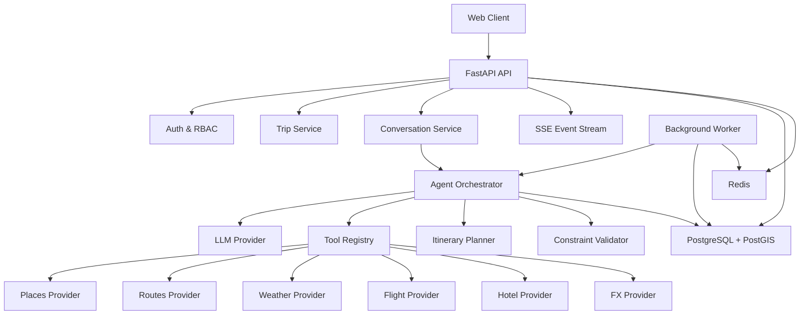
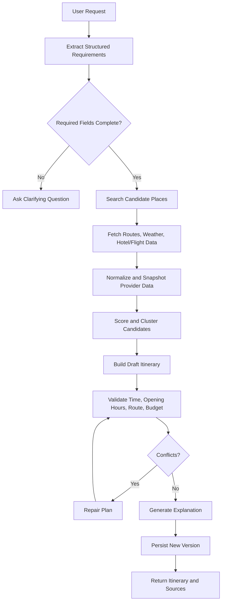

# WayWeaver AI 系统架构

文档状态：Draft  
版本：0.1.0  
阶段：T001

## 1. 架构目标

系统需要做到：

- 将 LLM 与实时事实数据分离；
- 将自然语言推理与确定性约束计算分离；
- 所有外部供应商可替换；
- 开发和测试不依赖真实外部 API；
- 支持长时间规划任务、事件流和取消；
- 支持行程版本、来源追踪和审计；
- 初期保持模块化单体，避免过早微服务化。

## 2. 总体架构



## 3. 架构风格

第一阶段采用模块化单体：

```text
一个代码仓库
一个 FastAPI API 服务
一个 Worker 服务
一个 PostgreSQL
一个 Redis
```

理由：

- 适合个人开发和本地运行；
- 模块边界仍然清晰；
- 避免分布式事务、服务发现和复杂部署；
- 将来可以把 Provider、规划任务或通知拆成独立服务。

## 4. 后端模块

```text
app/
├── api/              HTTP 路由与依赖
├── core/             配置、日志、异常、安全
├── db/               Engine、Session、Base
├── models/           SQLAlchemy 模型
├── schemas/          Pydantic 请求和响应
├── repositories/     数据访问
├── services/         业务用例
├── providers/        外部 API 适配器
├── planning/         评分、聚类、排程、预算
├── agents/           Agent 状态和工作流
├── tools/            Agent 可调用工具
└── main.py
```

依赖方向：

```text
API
→ Service
→ Repository / Planner / Provider Interface
→ Infrastructure Implementation
```

约束：

- Repository 不抛 `HTTPException`；
- Service 不直接依赖 FastAPI Request；
- Planner 不直接调用外部 HTTP；
- Agent 不直接访问数据库表；
- Provider 不返回供应商原始 JSON 给业务层。

## 5. 运行时组件

### API 服务

负责：

- 认证与权限；
- CRUD；
- 请求校验；
- 创建长任务；
- SSE 事件输出；
- 返回公开响应模型。

### Worker

负责：

- 长时间行程生成；
- Provider 批量调用；
- 重试；
- 行程重新规划；
- 导出任务；
- 将运行事件写入 Redis 或数据库。

### PostgreSQL

负责：

- 用户；
- Trip；
- 偏好；
- 行程版本；
- Agent Run；
- Tool Call；
- Provider Snapshot；
- 审计数据。

### PostGIS

负责：

- 地点坐标；
- 距离查询；
- 包围盒查询；
- 地理聚类辅助；
- 为后续路线优化提供地理数据。

### Redis

负责：

- 任务队列；
- 短期缓存；
- 并发限制；
- 幂等键；
- SSE 事件缓冲；
- 分布式锁。

## 6. Provider 抽象

统一接口示意：

```python
class PlacesProvider:
    async def search(self, query, location, filters): ...
    async def details(self, provider_place_id): ...


class RoutesProvider:
    async def route(self, origin, destination, mode): ...
    async def matrix(self, origins, destinations, mode): ...


class WeatherProvider:
    async def forecast(self, latitude, longitude, dates): ...
```

实现：

```text
FakePlacesProvider
AmapPlacesProvider
GooglePlacesProvider

FakeRoutesProvider
AmapRoutesProvider
GoogleRoutesProvider

FakeWeatherProvider
OpenMeteoWeatherProvider
```

Provider 必须负责：

- HTTP 调用；
- 认证；
- 超时；
- 响应解析；
- 供应商错误转换；
- 数据标准化；
- 基础重试；
- 来源和时间戳。

Provider 不负责：

- 用户权限；
- Trip 保存；
- 行程排序；
- Prompt；
- 最终回答。

## 7. 核心规划工作流



## 8. Agent 设计

第一版使用单个受控 LangGraph 工作流，不使用多 Agent。

建议 State：

```text
run_id
trip_id
user_message
requirements
missing_fields
candidate_places
route_matrix
weather
draft_itinerary
validation_issues
iteration_count
final_itinerary
sources
errors
```

节点：

```text
extract_requirements
request_clarification
search_places
fetch_live_context
plan_itinerary
validate_itinerary
repair_itinerary
explain_itinerary
persist_version
```

保护措施：

- 最大节点执行次数；
- 最大模型调用次数；
- 单工具和总任务超时；
- 工具白名单；
- 参数 Schema 校验；
- 取消信号；
- 人工确认；
- Checkpoint。

## 9. 行程规划引擎

### V1

使用规则、评分和贪心算法：

1. 必去地点优先；
2. 过滤明显不开放的地点；
3. 按用户兴趣评分；
4. 按地理位置分组；
5. 按日分配候选地点；
6. 插入交通时间；
7. 插入用餐与休息窗口；
8. 检查每日结束时间；
9. 超限时删除低分项目；
10. 输出无法解决的约束。

评分示例：

```text
兴趣匹配          0.30
必去优先级        0.25
地点质量          0.15
路线便利性        0.15
预算匹配          0.10
天气适应性        0.05
```

### V2

引入约束求解：

- 地点时间窗口；
- 每日总时长；
- 路线成本；
- 必选与可选地点；
- 用户体力限制；
- 求解时间上限。

## 10. 数据新鲜度

每条实时数据保存：

```text
provider
provider_record_id
retrieved_at
expires_at
source_url
raw_payload_hash
```

建议缓存策略：

| 数据 | 建议策略 |
|---|---|
| Place ID | 长期保存 |
| 地点基础信息 | 中期缓存并定期刷新 |
| 营业时间 | 较短缓存 |
| 路线时间 | 短期缓存 |
| 天气 | 很短缓存 |
| 航班/酒店价格 | 极短缓存并显示时间 |
| LLM 解释文本 | 可长期保存，但不是事实来源 |

具体缓存必须遵守供应商条款。

## 11. 可靠性设计

### 超时

- 每个 Provider 独立超时；
- 每个工具总超时；
- 每个 Agent Run 总超时；
- 前端通过 SSE 接收进度。

### 重试

只重试：

- 网络暂时失败；
- 429；
- 部分 5xx；
- 明确可恢复错误。

不重试：

- 参数错误；
- 权限错误；
- 不存在资源；
- 业务约束不可满足。

### 幂等性

以下接口支持 `Idempotency-Key`：

- 创建 Trip；
- 启动规划；
- 创建导出任务；
- 创建预订意向。

### 降级

- 天气不可用：继续规划，但显示缺少天气校验；
- 路线矩阵不可用：使用直线距离估算并明确标记；
- 航班/酒店不可用：生成地面行程，不编造价格；
- LLM 不可用：保留结构化数据和已完成工具结果。

## 12. 安全设计

- 密码使用安全哈希；
- JWT 密钥不进入仓库；
- 每次 Trip 访问验证用户身份和角色；
- LLM 不拥有绕过权限的数据库工具；
- 工具参数经过 Pydantic 校验；
- 对外 URL 调用防止 SSRF；
- 日志脱敏；
- 原始 Provider 响应限制大小；
- 用户内容与系统指令分离；
- Agent 工具结果视为不可信数据。

## 13. 可观测性

日志上下文：

```text
request_id
user_id
trip_id
run_id
tool_call_id
provider
duration_ms
status
retry_count
```

核心指标：

- API 延迟；
- Agent Run 成功率；
- Provider 错误率；
- Provider 缓存命中率；
- 平均工具调用次数；
- 平均模型轮数；
- Token 和费用；
- 规划冲突率；
- 用户修改次数。

## 14. 部署拓扑

开发环境：

```text
Docker Compose
├── api
├── worker
├── postgres-postgis
└── redis
```

生产演示环境：

```text
Reverse Proxy
├── Web
├── API
├── Worker
├── Managed PostgreSQL
└── Managed Redis
```

第一版不使用 Kubernetes。
