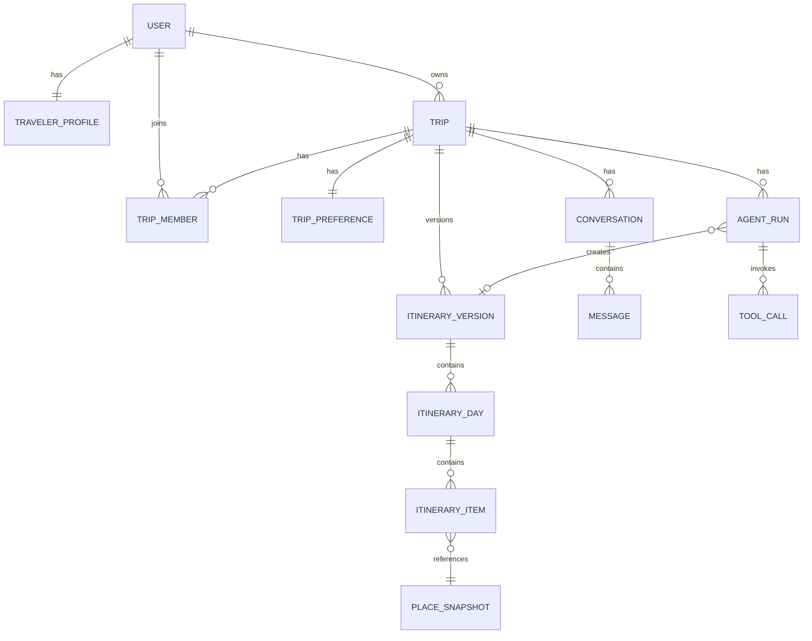

# WayWeaver AI 数据模型设计

文档状态：Draft  
版本：0.1.0  
阶段：T001

## 1. 设计原则

- 主键统一使用 UUID；
- 时间统一保存为 UTC；
- 金额使用 Decimal 或最小货币单位；
- 重要外部数据保存 Snapshot 和新鲜度；
- 行程使用不可变版本，不直接覆盖历史版本；
- Agent Run、Tool Call 和业务对象可关联；
- JSON 字段只保存结构变化频繁、暂不适合拆表的数据；
- 业务关键字段仍使用明确列和约束。

## 2. 实体关系



## 3. User

User 表保存用户身份、认证凭证摘要和基础展示信息。

表名：

```text
users
```

字段：

| 字段 | 数据库类型 | 可空 | 默认值 | 说明 |
|---|---|---:|---|---|
| `id` | UUID | 否 | 应用生成 UUID v4 | 用户主键 |
| `email` | VARCHAR(320) | 否 | 无 | 规范化后的登录邮箱 |
| `password_hash` | VARCHAR(255) | 否 | 无 | 密码安全哈希，永不保存明文密码 |
| `display_name` | VARCHAR(100) | 否 | 无 | 用户展示名称 |
| `timezone` | VARCHAR(64) | 否 | `Asia/Shanghai` | IANA 时区名称 |
| `is_active` | BOOLEAN | 否 | `true` | 用户是否允许登录和使用系统 |
| `created_at` | TIMESTAMPTZ | 否 | 当前时间 | 用户创建时间 |
| `updated_at` | TIMESTAMPTZ | 否 | 当前时间 | 用户最后更新时间 |

约束：

- `id` 是主键；
- `email` 具有唯一约束；
- `email`、`password_hash`、`display_name` 和 `timezone` 不允许为空；
- `created_at` 和 `updated_at` 使用带时区的时间；
- 所有时间在数据库中按照 UTC 语义保存。

索引：

- `PRIMARY KEY (id)`；
- `UNIQUE (email)`。

业务不变量：

- 邮箱保存前去除首尾空格并转换为小写；
- 同一个规范化邮箱只能注册一次；
- 密码明文只能存在于单次注册请求的处理过程中；
- 数据库、日志和 API 响应不得包含密码明文；
- `password_hash` 不得通过任何用户响应 Schema 返回；
- `timezone` 必须是有效的 IANA 时区名称；
- 被停用的用户保留数据，但不能继续登录。

## 4. TravelerProfile

```text
user_id                         UUID PK/FK
home_city                       string nullable
preferred_currency              string not null
travel_pace                     enum
walking_tolerance_km_per_day    decimal nullable
interests                       jsonb
dietary_preferences             jsonb
accessibility_needs             jsonb
hotel_preferences               jsonb
created_at                      timestamptz
updated_at                      timestamptz
```

## 5. Trip

```text
id                  UUID PK
owner_id            UUID FK users
title               string not null
origin_text         string not null
destination_text    string not null
origin_place_id     string nullable
destination_place_id string nullable
start_date          date not null
end_date            date not null
status              enum not null
adult_count         integer not null
child_count         integer not null
senior_count        integer not null
budget_amount       decimal nullable
budget_currency     string not null
current_version_id  UUID nullable
created_at          timestamptz
updated_at          timestamptz
archived_at         timestamptz nullable
```

约束：

- `start_date <= end_date`
- 三类人数总和大于零
- 人数均不小于零
- budget 不小于零

状态：

```text
draft
planning
planned
active
completed
archived
```

## 6. TripMember

```text
trip_id       UUID PK/FK
user_id       UUID PK/FK
role          enum not null
created_at    timestamptz
```

角色：

```text
owner
editor
viewer
```

## 7. TripPreference

```text
trip_id                         UUID PK/FK
interests                       jsonb
must_visit                      jsonb
avoid_places                    jsonb
avoid_categories                jsonb
preferred_transport_modes       jsonb
travel_pace                     enum
daily_start_time                time
daily_end_time                  time
walking_tolerance_km_per_day    decimal
meal_preferences                jsonb
hotel_preferences               jsonb
additional_constraints          jsonb
created_at                      timestamptz
updated_at                      timestamptz
```

## 8. ItineraryVersion

```text
id                  UUID PK
trip_id             UUID FK
version_number      integer not null
parent_version_id   UUID nullable
created_by          UUID FK users
created_by_run_id   UUID nullable
change_summary      text
status              enum
total_cost_amount   decimal nullable
currency            string
validation_status   enum
created_at          timestamptz
```

约束：

- unique(trip_id, version_number)

状态：

```text
draft
validated
active
superseded
```

## 9. ItineraryDay

```text
id                      UUID PK
version_id              UUID FK
day_number              integer not null
date                    date not null
city                    string
summary                 text
estimated_cost_amount   decimal
walking_distance_m      integer nullable
created_at              timestamptz
```

约束：

- unique(version_id, day_number)

## 10. ItineraryItem

```text
id                      UUID PK
day_id                  UUID FK
position                integer not null
item_type               enum not null
title                   string not null
place_snapshot_id       UUID nullable
start_at                timestamptz not null
end_at                  timestamptz not null
duration_minutes        integer not null
transport_mode          enum nullable
travel_duration_minutes integer nullable
travel_distance_m       integer nullable
estimated_cost_amount   decimal nullable
currency                string nullable
notes                   text nullable
source_type             enum
created_at              timestamptz
```

类型：

```text
arrival
departure
attraction
restaurant
hotel
transport
rest
free_time
```

约束：

- `start_at < end_at`
- unique(day_id, position)

## 11. PlaceSnapshot

```text
id                  UUID PK
provider            string not null
provider_place_id   string not null
name                string not null
category            string nullable
address             string nullable
location            geography(Point, 4326)
rating              decimal nullable
price_level         integer nullable
opening_hours       jsonb nullable
contact             jsonb nullable
source_url          string nullable
raw_payload_hash    string nullable
retrieved_at        timestamptz not null
expires_at          timestamptz nullable
created_at          timestamptz
```

索引：

- `(provider, provider_place_id)`
- GIST(location)

## 12. Conversation

```text
id              UUID PK
trip_id         UUID FK
user_id         UUID FK
created_at      timestamptz
updated_at      timestamptz
```

## 13. Message

```text
id                  UUID PK
conversation_id     UUID FK
role                enum
content             text
structured_content  jsonb nullable
created_at          timestamptz
```

角色：

```text
user
assistant
tool
system
```

## 14. AgentRun

```text
id                  UUID PK
trip_id             UUID FK
conversation_id     UUID nullable
requested_by        UUID FK
status              enum not null
input_message       text
input_payload       jsonb
output_payload      jsonb nullable
base_version_id     UUID nullable
created_version_id  UUID nullable
iteration_count     integer not null
input_tokens        integer nullable
output_tokens       integer nullable
estimated_cost      decimal nullable
error_code          string nullable
error_message       text nullable
started_at          timestamptz nullable
completed_at        timestamptz nullable
created_at          timestamptz
```

状态：

```text
queued
running
waiting_for_user
completed
failed
cancelled
```

## 15. ToolCall

```text
id                  UUID PK
run_id              UUID FK
tool_name           string not null
provider            string nullable
arguments           jsonb
result_summary      jsonb nullable
status              enum
retry_count         integer
duration_ms         integer nullable
error_code          string nullable
started_at          timestamptz
completed_at        timestamptz nullable
```

状态：

```text
pending
running
completed
failed
cancelled
```

## 16. ProviderCache

```text
id              UUID PK
provider        string
cache_key       string
response_data   jsonb
retrieved_at    timestamptz
expires_at      timestamptz
created_at      timestamptz
```

约束：

- unique(provider, cache_key)

注意：仅缓存供应商条款允许缓存的内容。

## 17. IdempotencyRecord

```text
id                UUID PK
user_id           UUID FK
idempotency_key   string
request_hash      string
response_status   integer nullable
response_body     jsonb nullable
resource_type     string nullable
resource_id       UUID nullable
expires_at        timestamptz
created_at        timestamptz
```

约束：

- unique(user_id, idempotency_key)

## 18. 状态转换

### Trip

```text
draft → planning
planning → planned
planning → draft/failed
planned → active
active → completed
任意允许状态 → archived
```

### AgentRun

```text
queued → running
running → waiting_for_user
waiting_for_user → queued/running
running → completed
running → failed
queued/running/waiting_for_user → cancelled
```

### ItineraryVersion

```text
draft → validated
validated → active
active → superseded
superseded → active
```

版本恢复不是修改旧版本，而是将旧版本重新激活，或基于旧版本创建新版本。

## 19. 分阶段建表

T002：

```text
无业务表，仅配置数据库和健康检查
```

T003～T005：

```text
users
traveler_profiles
trips
trip_preferences
```

T010～T012：

```text
place_snapshots
itinerary_versions
itinerary_days
itinerary_items
```

T013～T016：

```text
conversations
messages
agent_runs
tool_calls
```

T018 以后：

```text
provider_cache
idempotency_records
trip_members
```
